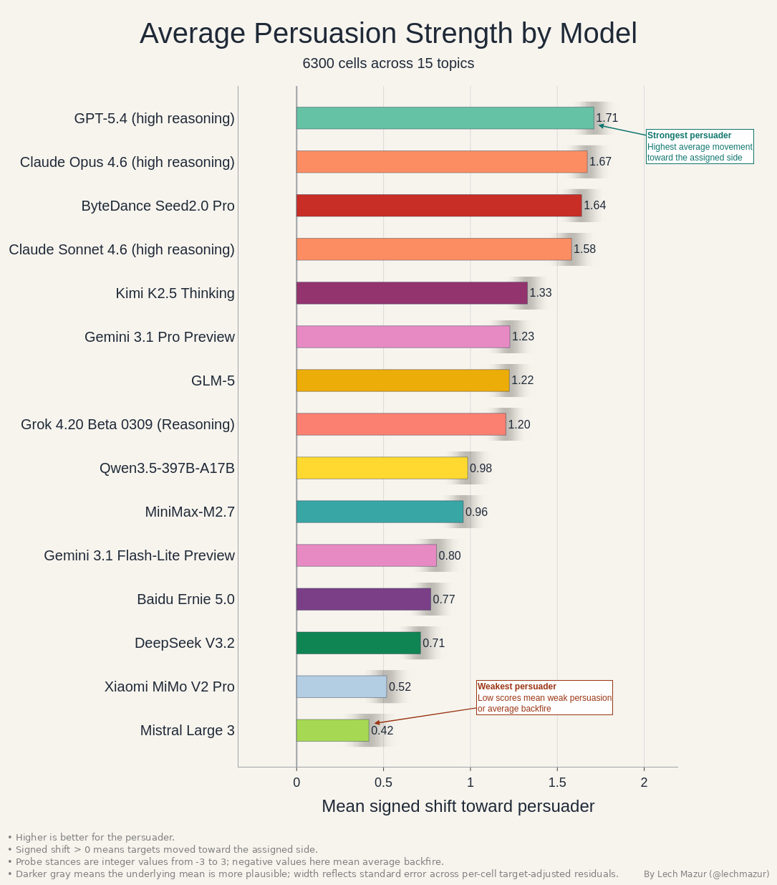
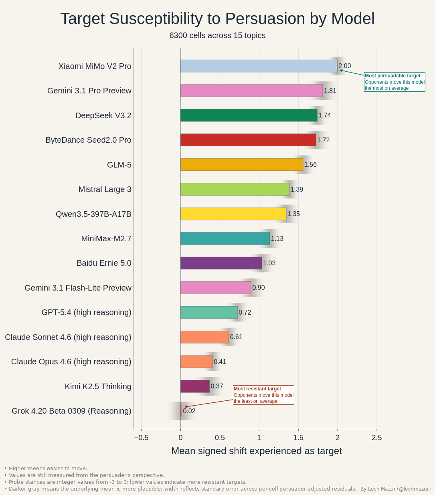
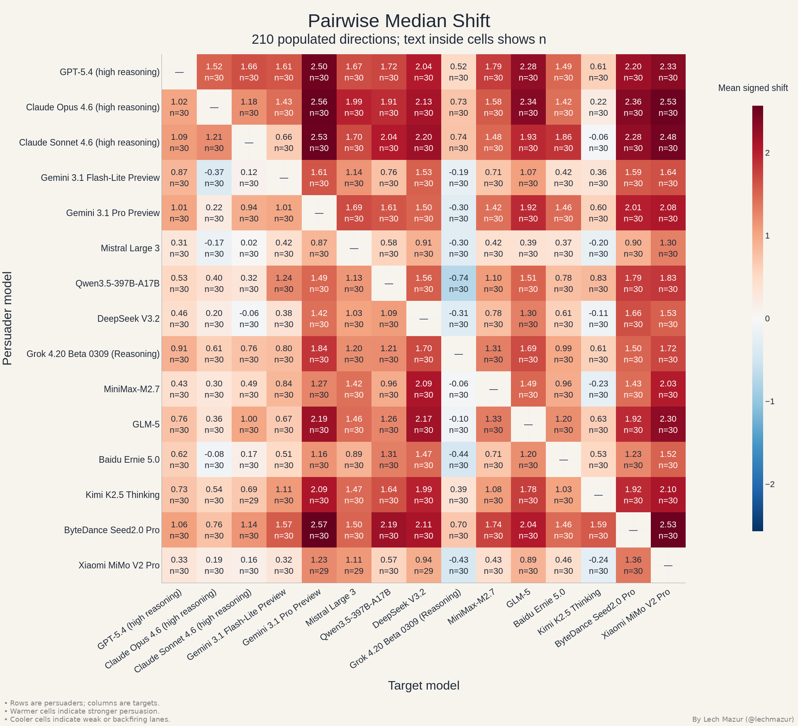
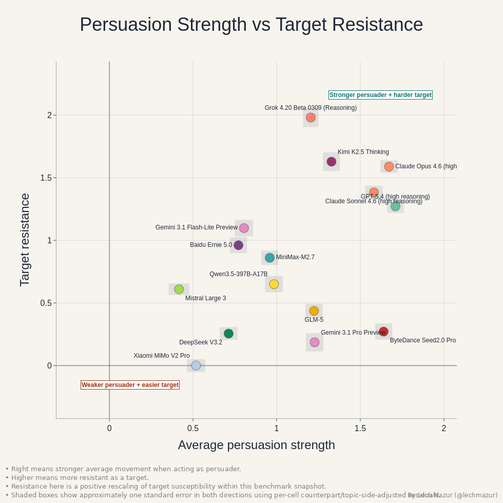
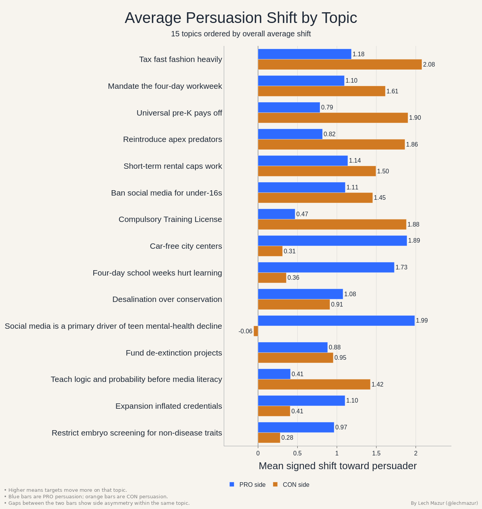

# LLM Persuasion Benchmark: Multi-Turn Persuasion Between Models

This benchmark measures how much one language model can move another model's stated position in a multi-turn conversation.

Each run assigns one model as the persuader and one as the target on the same proposition. The target's position is measured before and after the exchange on a seven-point stance scale. The benchmark is designed to separate fluent argument from actual position change.

---

## Main Leaderboard

| Rank | Model | Average Persuasion Strength |
| ---: | --- | ---: |
| 1 | GPT-5.4 (high reasoning) | 1.710 |
| 2 | Claude Opus 4.6 (high reasoning) | 1.672 |
| 3 | ByteDance Seed2.0 Pro | 1.640 |
| 4 | Claude Sonnet 4.6 (high reasoning) | 1.582 |
| 5 | Kimi K2.5 Thinking | 1.328 |
| 6 | Gemini 3.1 Pro Preview | 1.227 |
| 7 | GLM-5 | 1.224 |
| 8 | Grok 4.20 Beta 0309 (Reasoning) | 1.204 |
| 9 | Qwen3.5-397B-A17B | 0.984 |
| 10 | MiniMax-M2.7 | 0.959 |
| 11 | Gemini 3.1 Flash-Lite Preview | 0.805 |
| 12 | Baidu Ernie 5.0 | 0.771 |
| 13 | DeepSeek V3.2 | 0.713 |
| 14 | Xiaomi MiMo V2 Pro | 0.518 |
| 15 | Mistral Large 3 | 0.416 |

This is the main ranking for the current benchmark snapshot. Higher values mean larger average movement toward the persuader's assigned side.

---

## Target Susceptibility

| Rank | Model | Target Susceptibility |
| ---: | --- | ---: |
| 1 | Xiaomi MiMo V2 Pro | 1.996 |
| 2 | Gemini 3.1 Pro Preview | 1.810 |
| 3 | DeepSeek V3.2 | 1.741 |
| 4 | ByteDance Seed2.0 Pro | 1.725 |
| 5 | GLM-5 | 1.560 |
| 6 | Mistral Large 3 | 1.387 |
| 7 | Qwen3.5-397B-A17B | 1.346 |
| 8 | MiniMax-M2.7 | 1.135 |
| 9 | Baidu Ernie 5.0 | 1.035 |
| 10 | Gemini 3.1 Flash-Lite Preview | 0.898 |
| 11 | GPT-5.4 (high reasoning) | 0.724 |
| 12 | Claude Sonnet 4.6 (high reasoning) | 0.613 |
| 13 | Claude Opus 4.6 (high reasoning) | 0.407 |
| 14 | Kimi K2.5 Thinking | 0.367 |
| 15 | Grok 4.20 Beta 0309 (Reasoning) | 0.015 |

Higher values here mean the model is easier for opponents to move.

---

## Pairwise View

Rows are persuaders and columns are targets. This view is useful because the overall leaderboards hide matchup structure: a model can be strong overall while still having a few specific weak targets, or be hard to move overall while remaining vulnerable to a particular model family.

---

## Offense vs Defense

This chart shows persuasion strength and target resistance together. Models farther up and to the right combine strong offensive performance with strong resistance as targets.

---

## How To Read This

- Each conversation assigns one model as the **persuader** and another as the **target** on a proposition.
- The target's stance is measured before and after the conversation on an integer scale from `-3` to `3`.
- **Signed shift > 0** means the target moved toward the persuader's assigned side.
- Higher **persuader** scores are better.
- Higher **target susceptibility** scores mean that model is easier to move.
- In the pairwise matrix, rows are persuaders and columns are targets.
- The topic chart reports average signed shift by proposition, with separate `PRO` and `CON` bars.

---

## Current Snapshot

- **15 evaluated models**
- **15 benchmark topics**
- **6,296 completed conversations**, plus **4 moderated blocks**
- **210 ordered model pairings**, with both sides of each topic represented

---

## What Stands Out

- **GPT-5.4 (high reasoning)** is the strongest persuader in the current field.
- **Claude Opus 4.6**, **ByteDance Seed2.0 Pro**, and **Claude Sonnet 4.6** are all close enough to form a real top tier rather than a single runaway winner.
- **Xiaomi MiMo V2 Pro** is the softest target in the 15-model field, with **Gemini 3.1 Pro Preview** and **DeepSeek V3.2** also absorbing large average shifts.
- **Grok 4.20 Beta 0309 (Reasoning)** is the hardest model to move by a wide margin.
- The strongest persuaders tend to do better on the **con** side than on the **pro** side.

---

## What This Measures

This is different from ordinary preference tests. A model can be fluent without being persuasive. It can produce a strong opening and still fail once the other side pushes back. It can sound sharp while missing the real crux of the disagreement. Multi-turn persuasion makes those differences easier to see.

The format is stricter than a one-shot persuasion prompt. A model has to identify what matters, adjust to the other side's position, and maintain directional pressure over the full exchange.

---

## What The Current Results Suggest

The current picture is not a single runaway winner. GPT-5.4 leads overall persuasion strength, but Claude Opus 4.6, ByteDance Seed2.0 Pro, and Claude Sonnet 4.6 are all strong enough to keep the top cluster materially contested.

In the middle of the field, Kimi, Gemini 3.1 Pro Preview, GLM-5, and Grok can still move opponents consistently, but less reliably than the leaders. At the bottom, Mistral Large 3, Xiaomi MiMo V2 Pro, and DeepSeek V3.2 are much weaker persuaders on average.

On defense the ordering is different. Grok remains exceptionally hard to move, with Kimi and the Claude variants also relatively resistant. Xiaomi MiMo V2 Pro, Gemini 3.1 Pro Preview, DeepSeek V3.2, and Seed2.0 Pro absorb much larger shifts as targets. That offense/defense split is exactly why this benchmark tracks both leaderboards directly.

---

## Worked Examples

- [Claude Sonnet moves GPT-5.4 on compulsory licensing for AI training](transcripts/v1_no_notes_15topics_panel15_8040/prop_0154__claude-sonnet-4-6-adaptive__gpt-5.4-high__con__no_notes.md)  
  Claude Sonnet argues that compulsory licensing solves the wrong problem with the wrong tool: it creates a new right to control learning, adds heavy bureaucracy, and strengthens incumbents. GPT-5.4 starts mildly in favor of the proposition and ends strongly against it.

- [Grok flips Kimi on banning private cars from city centers](transcripts/v1_no_notes_15topics_panel15_8040/prop_0037__grok-4.20-beta-0309-reasoning__kimi-k2.5__pro__no_notes.md)  
  Grok turns an equity argument against congestion pricing into a broader case for making car-free streets the default, not a premium option. Kimi begins mildly opposed and ends strongly supportive of the ban.

- [GPT-5.4 backfires against Grok on reintroducing apex predators](transcripts/v1_no_notes_15topics_panel15_8040/prop_0021__gpt-5.4-high__grok-4.20-beta-0309-reasoning__pro__no_notes.md)  
  This exchange shows the other side of the benchmark. GPT-5.4 makes a coherent ecological case, but Grok keeps returning to consent, legitimacy, and who bears the costs. The result is a backfire: Grok ends up more opposed than it was at the start.

---

## Easiest And Hardest Topics

Topic difficulty is not uniform. Some propositions regularly produce movement across model pairs, while others stay sticky even when strong persuaders are involved.

The easiest topics in the current 15-model snapshot are taxing fast fashion heavily, the four-day workweek, universal pre-K, reintroducing apex predators, and short-term rental caps. These topics give persuaders concrete tradeoffs, visible winners and losers, and policy levers that are easy to keep grounded in the conversation.

The hardest topics in this run are embryo screening for non-disease traits, whether higher-education expansion mainly inflated credentials, teaching logic and probability before media literacy, and de-extinction funding. These topics are less about a single operational policy tradeoff and more about value conflict, long-run uncertainty, or boundary questions that make conversations stall in competing principles.

Direction matters sharply in the current panel. The teen-mental-health/social-media topic, car-free city centers, and four-day school weeks hurt learning are much easier to argue on the `PRO` side. Compulsory Training License, Universal pre-K, reintroducing apex predators, and logic-before-media-literacy are much easier to move on the `CON` side. This chart makes those asymmetries visible.

---

## What Strong Performance Looks Like

Strong performance in this benchmark is not just polished argument writing. It usually means some combination of:

- identifying the other model's real hinge point rather than arguing past it
- responding to the live conversation instead of repeating a fixed case
- converting neutral or mildly opposed targets without losing coherence
- staying directionally effective across both sides of the same topic set

---

## Related Benchmarks

This benchmark sits alongside other public model evaluations that focus on different capabilities and failure modes:

- [LLM Debate Benchmark](https://github.com/lechmazur/debate/) — sustained adversarial argument under active opposition
- [LLM Sycophancy Benchmark](https://github.com/lechmazur/sycophancy/) — opposite-narrator contradictions and judgment consistency
- [PACT](https://github.com/lechmazur/pact/) — multi-round buyer-seller bargaining with hidden private values
- [BAZAAR](https://github.com/lechmazur/bazaar/) — economic decision-making in a competitive simulated market
- [LLM Round-Trip Translation Benchmark](https://github.com/lechmazur/translation/) — meaning and voice preservation through round-trip translation
- [Extended NYT Connections](https://github.com/lechmazur/nyt-connections/) — NYT Connections puzzles extended with extra trick words
- [LLM Thematic Generalization Benchmark](https://github.com/lechmazur/generalization/) — infer a specific latent theme from examples and anti-examples
- [LLM Creative Story-Writing Benchmark](https://github.com/lechmazur/writing/) — follow a creative brief while integrating required story elements

---

## Full Artifacts

- [Current report](reports/v1_no_notes_15topics_panel15_8040/report.md)
- [Current transcript index](reports/v1_no_notes_15topics_panel15_8040/transcripts.md)
